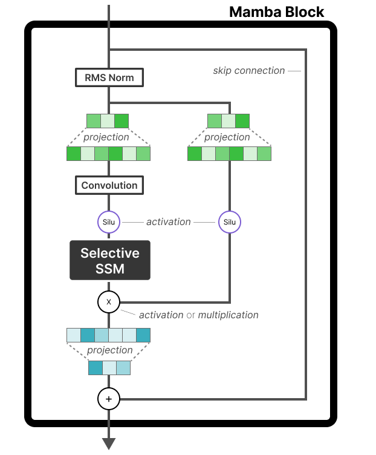
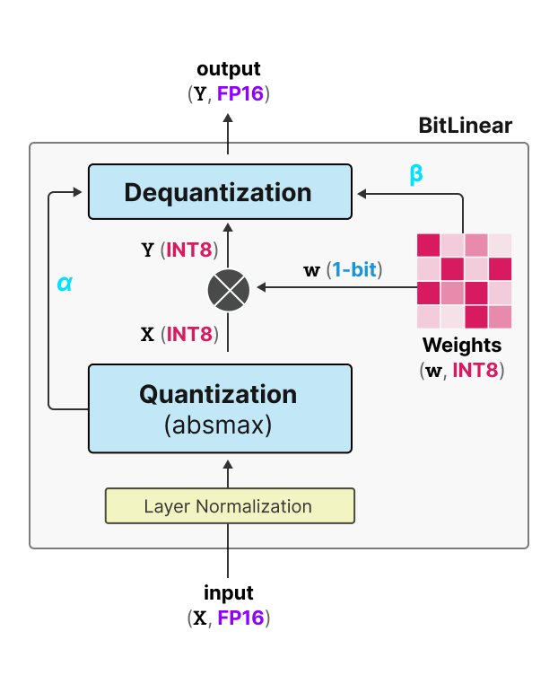
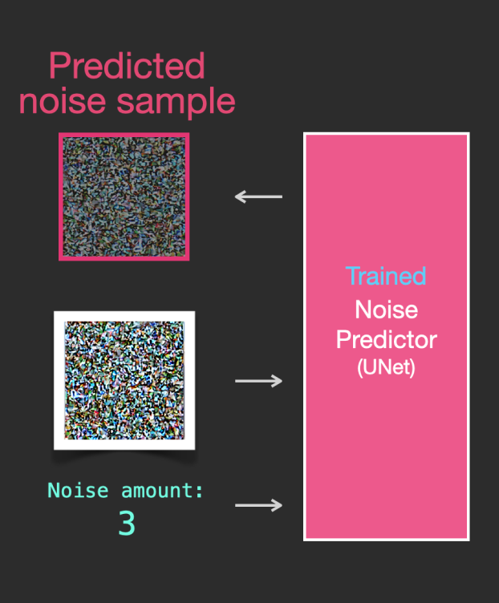

# 直感LLM

本リポジトリはオライリー・ジャパン発行書籍『直感LLM』のサポートサイトです。

## サンプルコード

| 章  | ノートブック  |
|---|---|
| 第1章: 入門 大規模言語モデル  |    |
| 第2章: トークンと埋め込み  |   |
| 第3章: 大規模言語モデルの仕組み  |   |
| 第4章: テキスト分類 |   |
| 第5章: テキストクラスタリングとトピックモデリング  |   |
| 第6章: プロンプトエンジニアリング  |   |
| 第7章: 高度なテキスト生成のテクニックとツール  |   |
| 第8章: セマンティック検索とRAG  |   |
| 第9章: マルチモーダルな大規模言語モデル  |   |
| 第10章: テキスト埋め込みモデルの作成  |   |
| 第11章: 分類モデルのファインチューニング  |   |
| 第12章: 生成モデルのファインチューニング  |   |

## ボーナスコンテンツ

著者のWebサイトでは次のコンテンツも紹介しています。

| [A Visual Guide to Mamba](https://newsletter.maartengrootendorst.com/p/a-visual-guide-to-mamba-and-state)             |  [A Visual Guide to Quantization](https://newsletter.maartengrootendorst.com/p/a-visual-guide-to-quantization) | [The Illustrated Stable Diffusion](https://jalammar.github.io/illustrated-stable-diffusion/) |
:-------------------------:|:-------------------------:|:-------------------------:
  |   |  
**[A Visual Guide to Mixture of Experts](https://newsletter.maartengrootendorst.com/p/a-visual-guide-to-mixture-of-experts)**  | **[A Visual Guide to Reasoning LLMs](https://newsletter.maartengrootendorst.com/p/a-visual-guide-to-reasoning-llms)**  |  **[The Illustrated DeepSeek-R1](https://newsletter.languagemodels.co/p/the-illustrated-deepseek-r1)**
  |   |  
